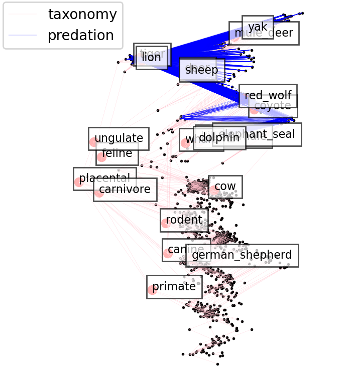

### Mammal Taxonomy and Predation Relations

This is an augumented dataset from the paper [entailment cone](https://github.com/dalab/hyperbolic_cones/tree/master/data/maxn).
This dataset has two sets of relations: taxonomic relations and predation relations. While taxnomic relations are conveniently
available as part of the word-net, and serve as popular benchmarks across hyperbolic embedding literature,
the predation relations are not. Most predation relation datasets in scientific literature are localized in
specific geographical regions and seasons of the year, and typically involve non-mammal entities such as
insects, bacteria, and plants. To obtain a comprehensive set of predation relationships among mammals,
we queried ChatGPT-4 by asking it to identify the most prominent predation relations among all nodes in
our dataset. Using this method, we generated a predation DAG that consists of 331 nodes and 5702 basic edges. 

This is part of a project on hyperbolic embedding of multi-relational datasets.
